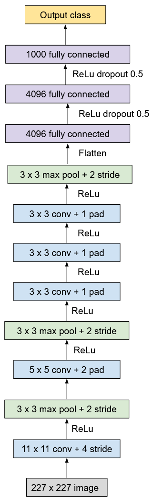

In order to process the large amounts of image data collected by underwater imaging sensors, we evaluated the usage of convolutional neural networks to perform image classification. We preprocessed the image data and trained CNN models 121 different classes of plankton. 

## Description of Files

Preprocessing:
- **gen_train/test.py + preprocess.ipynb**: resize images to be 48 x 48

Models: 
- **alexnet.py**: PyTorch implementation of AlexNet

Scripts: 
- **AlexNet_Epochs.ipynb**: hyperparameter tuning epoch size
- **alexnet_leaky.ipynb**: implementation of Leaky ReLU
- **AlexNet_LearningRate_Confusion.ipynb**: hyperparameter tuning learning rate
- **CNN_main.ipynb**: base file of AlexNet implementation
- **KFolds.ipynb**: implementation of cross-validation

## Data Selection 

Data for this project was taken from the [2014 National Data Science Bowl](https://www.kaggle.com/c/datasciencebowl). In this set, we are given images spanning 121 different classes of plankton. In addition, our dataset comes highly imbalanced. 

## Preprocessing and Optimization

Using the image data, we resize all images to be 48 x 48. We also nrmalize the RGB values of the images in accordance with their relative weight in grayscale. From here, we try several techniques to improve the accuracy of our classifier: varying learning rate, varying optimizer, implementing Leaky ReLU, implementing cross-validation, and augmenting data via affine transformation.

## Training and Testing

Using the data, we look to train and test our our classifier using the AlexNet implementation from PyTorch. After hypertuning our parameters, we were able to obtain a classification accuracy of 74%.

## Acknowledgements

This group project was inspired by COGS 181: Neural Networks and Deep Learning, taught at UC San Diego under Dr. Zhuowen Tu.
